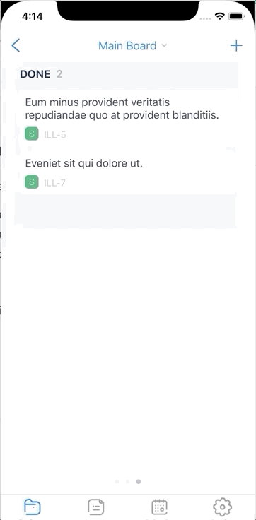
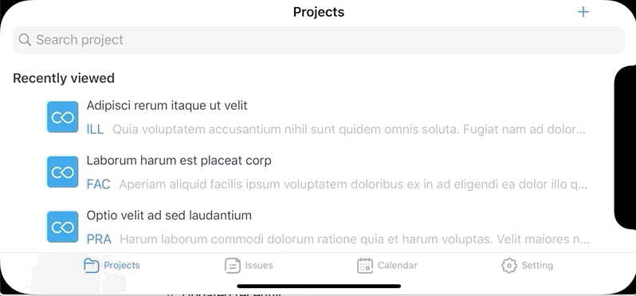

# Agile-Board-Pro
Personal issue tracking app that helps you to manage projects and issues. The app supports both portrait and landscape mode.

## Major features

### Drag and drop to order the issue.

### Drag and drop to transtion issue on portrait mode.

### Drag and drop to transtion issue on landscape mode.

### Add custom board

### Re-order board's column

### Quickly filter issues by the following criteria
  - All
  - Due today
  - Due this week
  - Created recenlty
  - Updated recently
  - Open
  - Done
  - Story
  - Task
  - Bug
  - Epic
  
### Supports calendar view to display issues by date

